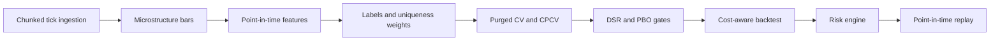
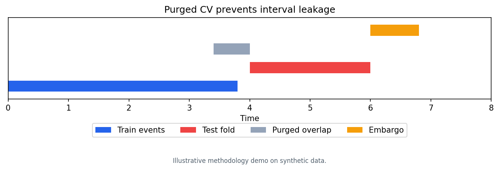
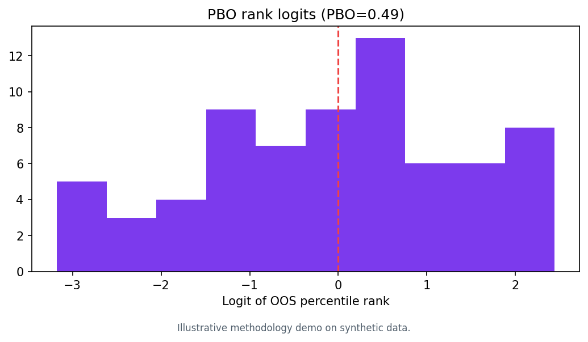
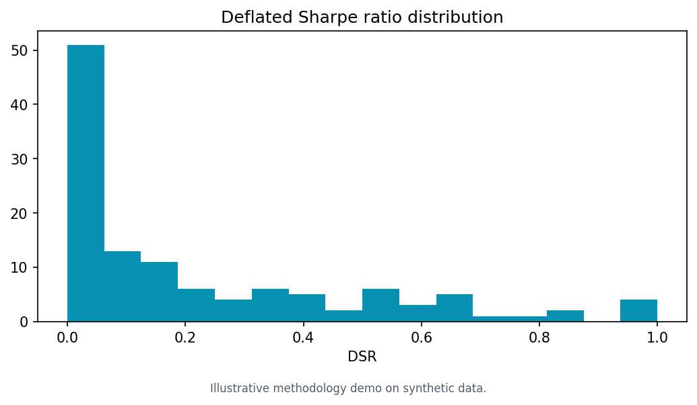
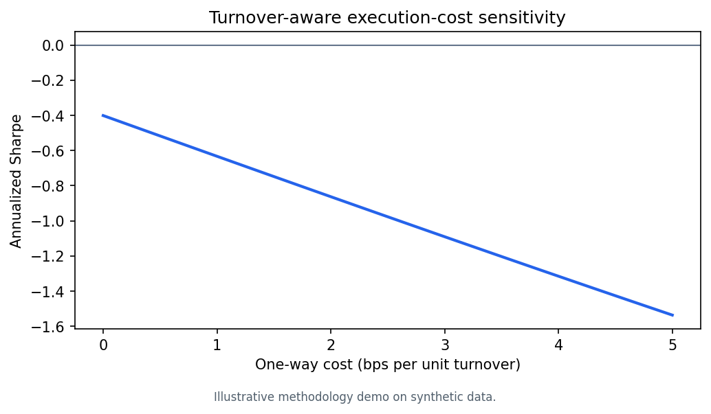
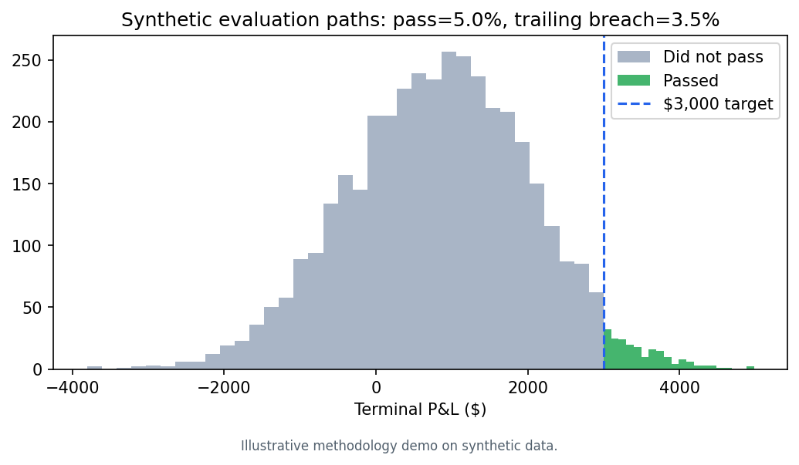
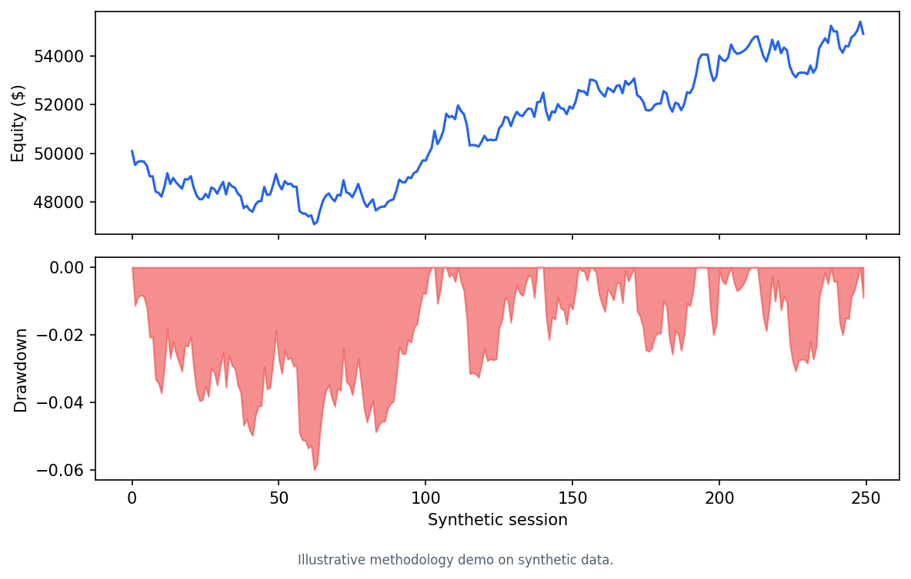
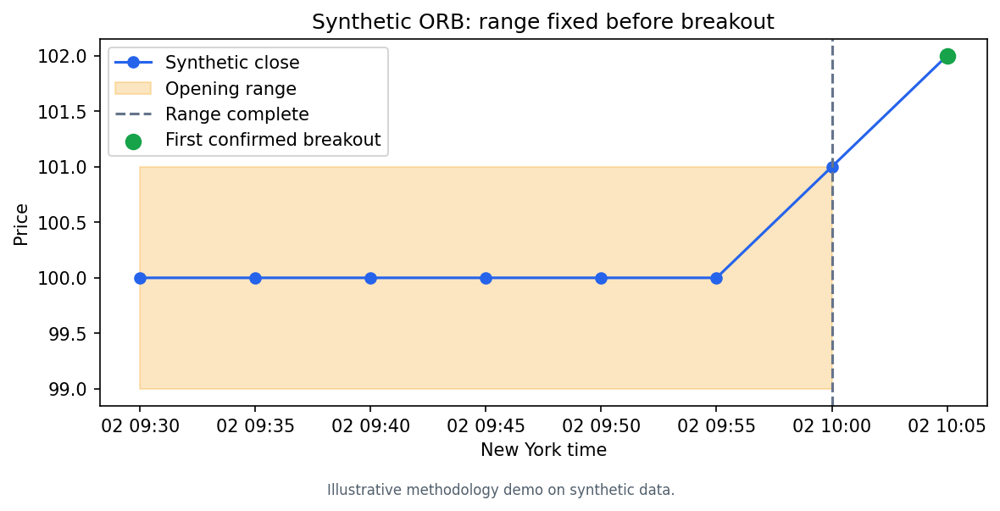
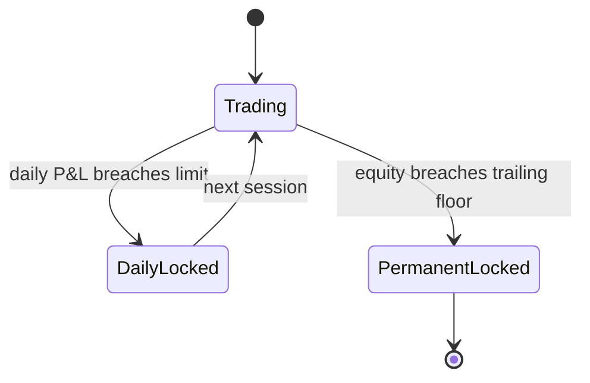

# Algorithmic Futures Platform

A compact, reproducible futures research platform connecting chunked market-data ingestion, point-in-time features, leakage-aware validation, cost-aware execution, and prop-firm-style risk controls.

> Research and engineering demonstration only. Not financial advice. Every chart and fixture is synthetic; no displayed number represents live or historical strategy performance.

## Public portfolio scope

> **This repository is a deliberately curated public extraction of a larger private research and execution system.**

The portable research algorithms, validation methods, risk controls, synthetic examples, and tests are included to demonstrate the system's technical design. Live brokerage integrations, cloud deployment infrastructure, credentials, proprietary market data, trained model artifacts, account-specific configuration, and production runners remain private and are intentionally excluded.

## System at a glance



## Validation and overfitting control





All figures above are illustrative methodology demos on deterministic synthetic data. Purging removes overlapping event labels; embargo blocks immediate post-test observations; CPCV samples multiple paths; CSCV-style PBO and DSR penalize strategy selection.

## Execution and risk






All figures above are illustrative methodology demos on deterministic synthetic data. Signals execute one bar later, costs scale with turnover, and the risk engine separately enforces daily loss and high-water-mark trailing drawdown.



## Quickstart

```bash
python -m venv .venv
source .venv/bin/activate
python -m pip install -e '.[dev]'
pytest
python scripts/generate_portfolio_figures.py
```

No credentials, network access, or external data are required. Tick CSV input must be ordered by receive timestamp; the chunked reader validates this contract.

## Deliberate scope

- This is research infrastructure, not a broker-connected trading application.
- The vector backtest models one-bar-lagged positions and linear turnover costs; it does not claim intrabar fill, queue-position, market-impact, or margin fidelity.
- PBO expects an even number of independent performance subperiods. DSR consumes equally spaced returns in consistent units and reports a per-observation Sharpe.
- The risk state machine uses a configurable futures-session rollover and simplified daily-loss and trailing-drawdown rules. Actual evaluation-account rules vary by provider.

## Engineering evidence

| Capability | Runnable code |
|---|---|
| Chunked trade aggregation | `ingestion/microflow.py` |
| OFI, VPIN, Kyle lambda, Roll spread | `core/microstructure.py` |
| Daily-loss and trailing-drawdown state machine | `core/risk.py` |
| Point-in-time execution and explicit costs | `core/execution.py` |
| Purged K-fold and CPCV path construction | `validation/purged_cv.py` |
| PBO and Deflated Sharpe diagnostics | `validation/diagnostics.py` |
| Triple barriers and event uniqueness | `pipeline/labels.py`, `pipeline/weights.py` |
| Pre-registration hashing and GO/NO-GO gate | `strategies/rule_based/validation.py` |
| Point-in-time decision replay | `pipeline/replay.py` |
| Deterministic research visuals | `scripts/generate_portfolio_figures.py` |

See [architecture](docs/ARCHITECTURE.md) and [validation methodology](docs/VALIDATION.md) for design boundaries and assumptions.
