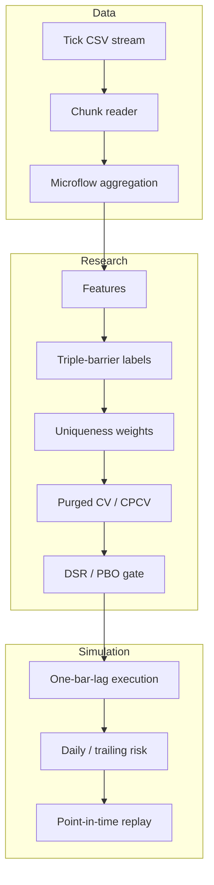

# Architecture

This public extraction keeps deterministic research logic and removes operational coupling to brokers, proprietary datasets, model artifacts, and cloud infrastructure.

## Boundaries

- `ingestion/` accepts chunked trade records and emits stable bar schemas.
- `core/` owns market microstructure, execution costs, and stateful risk invariants.
- `pipeline/` owns point-in-time transformations, labels, weights, manifests, and replay.
- `validation/` owns temporal split construction and model-selection penalties.
- `strategies/rule_based/` demonstrates a composable engine, regular-session ORB rule, and frozen gate.

## Reproducibility contract

Inputs are explicit, outputs are deterministic, configuration is content-hashed, and replay passes each decision function only history available at that timestamp. The chunked CSV reader requires receive-time ordering and rejects malformed trade sides and sizes. The public tree has no network calls or implicit data paths.
