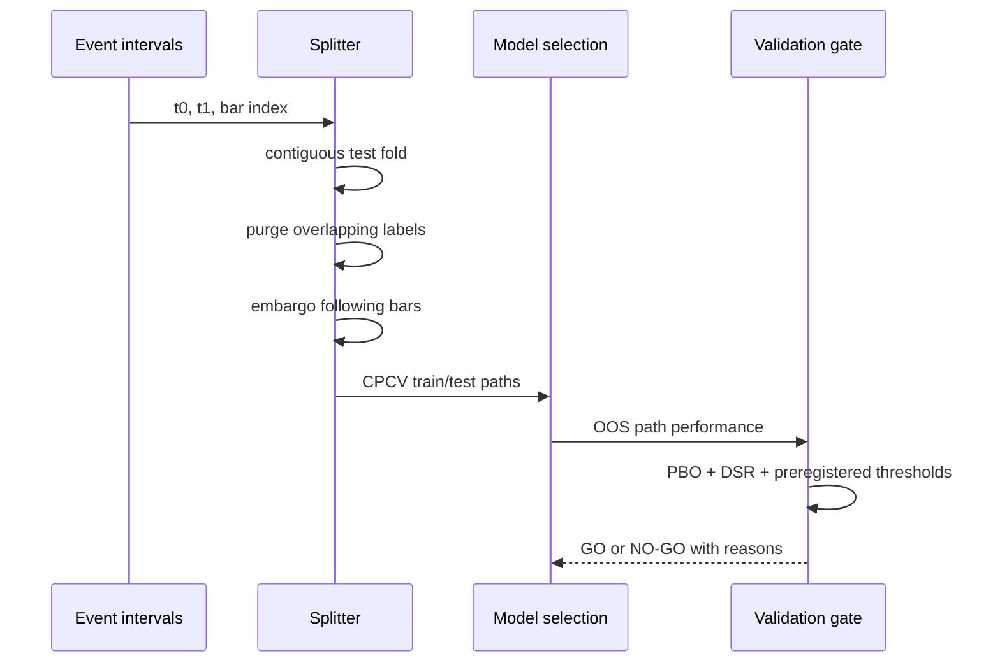

# Validation methodology

The central question is not whether one backtest is profitable, but whether an observed edge survives temporal leakage controls, selection penalties, costs, and path uncertainty.

## Leakage controls

Events are intervals, not independent rows. A training label is removed when its `[t0, t1]` overlaps the test interval. An additional bar-count embargo removes events beginning immediately after test labels end. Tests assert zero remaining overlap.

## Selection controls

The PBO diagnostic uses combinatorially symmetric cross-validation: each unique half of an even-sized subperiod matrix selects the best in-sample candidate, then ranks that candidate on the complementary half. PBO is the fraction of out-of-sample rank logits at or below zero. DSR raises the Sharpe benchmark as the number of attempted configurations grows while accounting for skew, kurtosis, and estimation error.

These diagnostics do not make dependent observations independent. Callers remain responsible for constructing economically meaningful, non-overlapping subperiod returns and for reporting the true number of attempted configurations.

## Frozen gate

A canonical SHA-256 hash covers the holdout, trial count, thresholds, and strategy parameters. The conjunctive gate requires enough trades, enough calendar months, positive-month breadth, and a minimum DSR. Changing descriptive identity does not change the statistical rule; changing any decision field does.

## Simulation assumptions

Execution uses a one-bar signal lag and charges one-way costs on absolute position turnover. Intrabar path, queue position, nonlinear impact, and margin claims are avoided in this compact vector engine. The ORB example ignores premarket bars and triggers only when a regular-session close crosses the completed opening range. The Monte Carlo visual applies a synthetic $900 daily-loss cap and $2,000 high-water-mark trailing floor; these are fixed demonstration assumptions, not current prop-firm rule claims.

All PNGs in `docs/figures/` are illustrative methodology demos generated from deterministic synthetic data. They are not performance claims.
